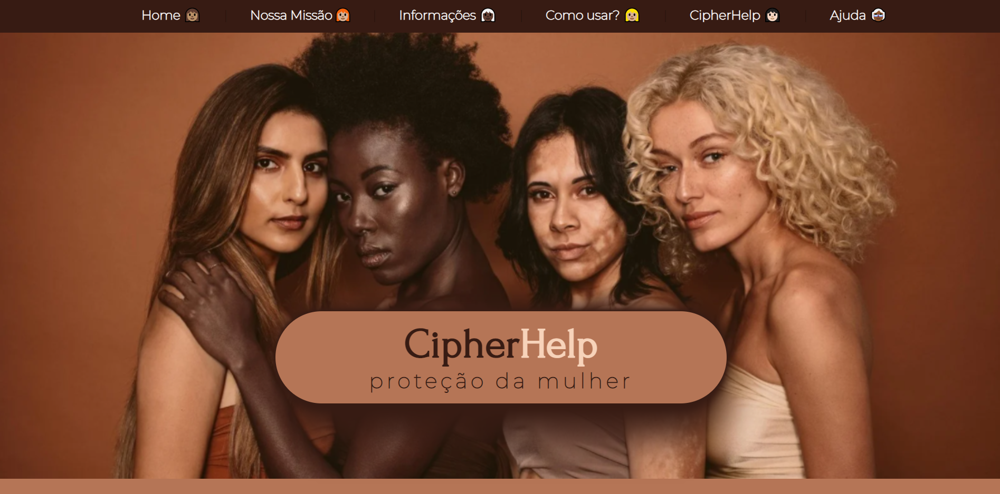

# CipherHelp :lock:

## Projeto 1 - Cifra de César desenvolvido no bootcamp de Front-End da SAP006 Laboratória :yellow_heart:

## Índice

* [1. Sobre o produto](#1-sobre-o-produto)
* [2. Tipos de Violência contra Mulher](#2-tipos-de-violência-contra-mulher)
* [3. Nosso Propósito](#3-nosso-propósito)
* [4. Como usar?](#4-como-usar?)

---
## :dart: Sobre o produto 

O CipherHelp foi desenvolvido com o objetivo de ajudar as mulheres que se encontram em situação de 
vulnerabilidade e/ou sofrendo qualquer
tipo de violência. Esse produto possui a missão de enfrentar, por meio de um
mecanismo seguro, a violência contra a mulher. 

A interface e design do site foi toda baseda nas cores das mulheres da imagem da Home,
com a intenção de representar a diversidade da mulher em todo o site na
tentativa de torná-lo o mais acolhedor possível.

Sei que a ferramenta construída (CipherHelp) não é tão segura por causa do próprio sistema de criptografia e que talvez não fosse viável para existir de verdade,  mas achei boa a ideia de tentar criar um ambiente seguro pras mulheres relatarem seus problemas e fiquei muito animada com a possibilidade de poder ajudar as mulheres, ainda mais durante essa época pandêmica onde os casos de medo e subnotificação cresceram exponencialmente por causa das circunstâncias que estamos vivendo. Todo dia vejo diversas notícias de violência contra mulher e sei que sempre existe (um grande infelizmente aqui), mas durante a pandemia parece que a situação de vulnerabilidade da mulher está ficando cada vez mais incontrolável.

Gostaria de ter implementado a funcionalidade de envio direto da mensagem codificada para alguém ou para polícia por meio de e-mail,  mas não sei como fazer isso, se seria por API ou de outra maneira.  Mas essa era a intenção completa, poder enviar a mensagem diretamente do site como um alerta pra quem receber.

Na verdade, percebi que essa ferramenta é perfeitamente segura para o seu devido propósito, ou seja, proteger a mensagem da vítima do seu agressor, e ao mesmo tempo é uma ferramenta simples para ser usada por qualquer pessoa. Dessa forma, não seria necessário um super sistema de criptografia avançada, pois não estamos querendo proteger a mensagem de um hacker, mas sim de uma pessoa leiga (agressor).

Pensei em explicar no site como funciona a Cifra de César, pois me parecia algo importante para o usuário entender como tudo funciona. Porém, percebi que na verdade, a explicação da cifra a tornaria menos segura e possivelmente decifrável, pois, como já foi dito anteriormente, essa cifra é simples e de fácil compreensão. Sendo assim, a informação sobre o método de criptografia não pode ser exibido para própria proteção da mensagem codificada.

Gostaria que meu produto cuida-se de toda a parte de segurança e que a mulher "apenas" tivesse que se preocupar com a superação da barreira de pedir ajuda e contar sua história. Seria algo terrível se o agressor descobrisse que a vítima está tentando pedir ajuda, então isso deve ser evitado a todo custo.

---
## :woman: Tipos de Violência contra Mulher
Estão previstos cinco tipos de violência doméstica e familiar contra a mulher na Lei Maria da Penha: física, psicológica, moral, sexual e patrimonial − Capítulo II, art. 7º, incisos I, II, III, IV e V.

Essas formas de agressão são complexas, perversas, não ocorrem isoladas umas das outras e têm graves consequências para a mulher.

Qualquer uma delas constitui ato de violação dos direitos humanos e deve ser denunciada.

A Central de Atendimento à Mulher é um serviço criado para o combate à violência contra a mulher e oferece três tipos de atendimento: registros de denúncias, orientações para vítimas de violência e informações sobre leis e campanhas.

---
## :heart: Nosso Propósito
Sabemos que, apesar dos altos índices de violência contra mulher no Brasil, ainda existe uma enorme subnotificação desses crimes causada, sobretudo, pelo imenso medo de denunciar o agressor.

O motivo de tal receio encontra-se, principalmente, nas ameaças cruéis sofridas pela vítima diante do ofensor. Por isso, na tentativa de criar um ambiente seguro e confiável, desenvolvemos uma ferramenta para criptografar mensagens de socorro e desabafo das mulheres e encaminhá-las para a polícia ou para alguém de confiança.

A CipherHelp é uma alternativa simples e acessível para toda e qualquer mulher que se encontre numa situação de violência e que, por diversas razões, não disponha de meios físicos e/ou psicológicos para realizar uma denúncia presencial ou até mesmo buscar ajuda da família e amigos.

---
## :gear: Como usar?
Para usar a CipherHelp e buscar a ajuda necessária, basta digitar sua mensagem no campo de texto, escolher a chave de criptrografia e apertar no botão Criptografar.

Em seguida, sua mensagem criptrografada aparecerá na tela. Agora é só copiar o texto codificado e enviar para uma instituição ou pessoa de confiança. Lembre-se também de fornecer esse site e a sua chave de criptografia para que possam decodificar seu texto utilizando o botão Descriptografar.

Logo abaixo, disponibilizamos algumas opções seguras de denúncias como sugestão para envio da sua mensagem.

---
## :link: Links para Redes de Apoio à Mulher
* [Instituto Maria da Penha](https://www.institutomariadapenha.org.br/)
* [Disque denúncia de violência contra a mulher](https://www.gov.br/pt-br/servicos/denunciar-e-buscar-ajuda-a-vitimas-de-violencia-contra-mulheres)
* [Ouvidoria Nacional de Direitos Humanos](https://www.gov.br/mdh/pt-br/ondh/)
* [Central de Atendimento à Mulher](https://mdh.metasix.solutions/portal/servicos/informacao?t=50&servico=234)
* [Serviços de Ajuda](https://www.gov.br/mdh/pt-br/ondh/servicos/grupo-vulneravel)
* [Ministério da Mulher, da Família e dos Direitos Humanos](https://www.gov.br/mdh/pt-br)
* [Polícia Civil - PB](https://www.policiacivil.pb.gov.br/noticias/denuncie-qualquer-violencia-contra-a-mulher-1)
* [Delegacia Online - PB](http://www.delegaciaonline.pb.gov.br/pages/index.xhtml)

---
## :robot: Tecnologias 

- HTML 5
- CSS3
- JavaScript
- Node.js

---
## ✔️ Resultados

---
## :woman_technologist: Sobre a autora
### Patrícia Barnabé

- [LinkedIn](https://www.linkedin.com/in/patriciabarnabe)
- E-mail: patbarnabe5@gmail.com
